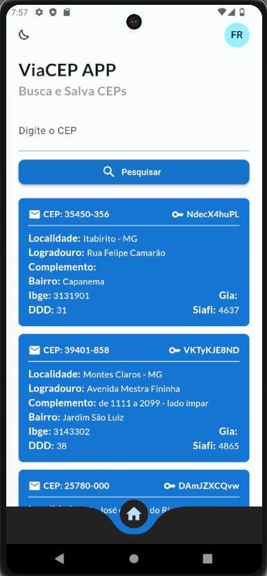
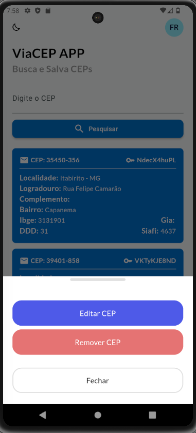
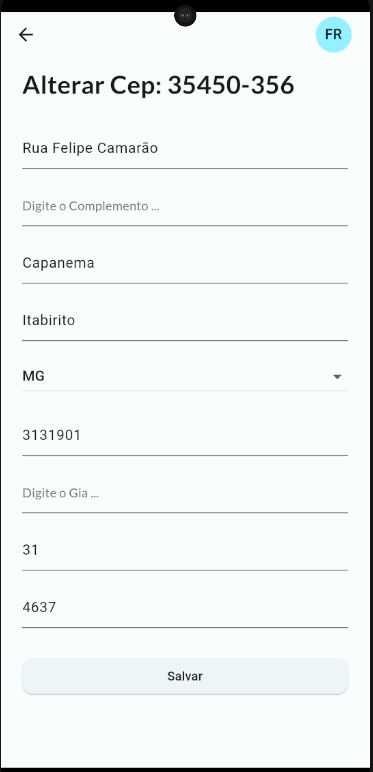

# 🎉🎉 Desafio ViaCEP Flutter - **Bootcamp Santander 2023**.

> "Toda a nossa ciência, comparada com a realidade, é primitiva e infantil – e, no entanto, é a coisa mais preciosa que temos." — Albert Einstein

## 📸 Descrição do Desafio
Neste Desafio, você terá que criar uma aplicação Flutter do Zero aplicando na prática os conceitos de Assincronismo e Consumo de API. Para tanto devemos:

* Criar uma aplicação Flutter​ ✅
* Criar uma classe de CEP no Back4App ​✅
* Consulte um Cep no ViaCep, após retornado se não existir no Back4App, realizar o cadastro ​✅
* Listar os CEPs cadastrados em forma de lista, possibilitando a alteração e exclusão do CEP ✅

## 🔖 Extras
Durante os estudos para construir o APP coloquei algumas funcionalidades extras, as quais serão listadas abaixo:

* Modo Escuro: Usando o controle de temas e o storage da biblioteca `GETX`.
* Localização: Usando a biblioteca `Intl` para colocar as datas dos datepickers no formato `pt_BR`;
* Bottom Navigator estilizado: Foi utilizada a biblioteca `curved_navigation_bar` respeitando as cores do tema definido no sistema;
do registro em questão;

## Imagens do APP

## 📚 Bibliografia
 
* [Curved Navigator](https://pub.dev/packages/curved_navigation_bar)
* [Flutter Localizations](https://pub.dev/packages/flutter_localization)
* [Intl](https://pub.dev/packages/intl)
* [Get Storage](https://pub.dev/packages/flutter_typeahead)
* [Get](https://pub.dev/packages/get)
* [Brasil_fields](https://pub.dev/packages/brasil_fields)
* [Flutter_dotenv](https://pub.dev/packages/flutter_dotenv)
* [dio](https://pub.dev/packages/dio)